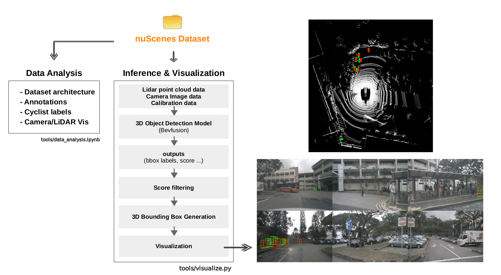
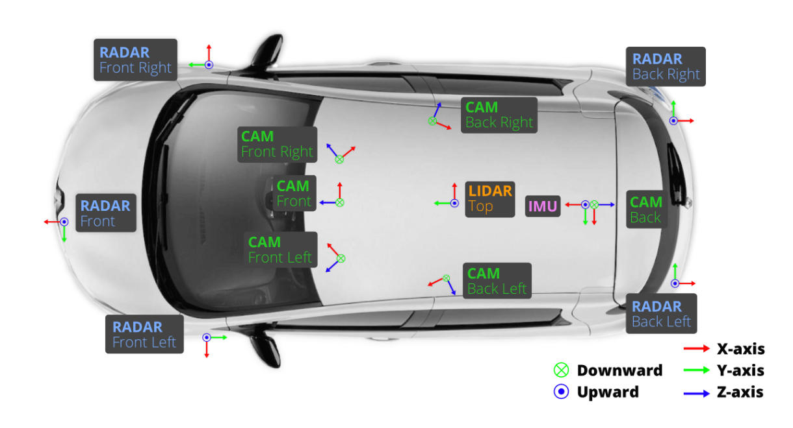
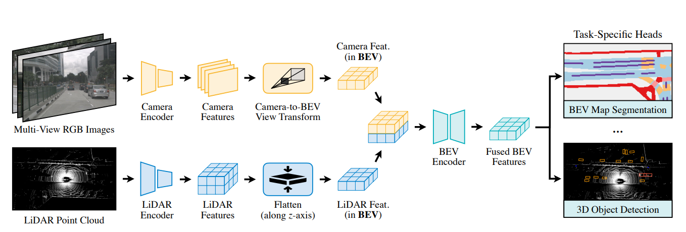
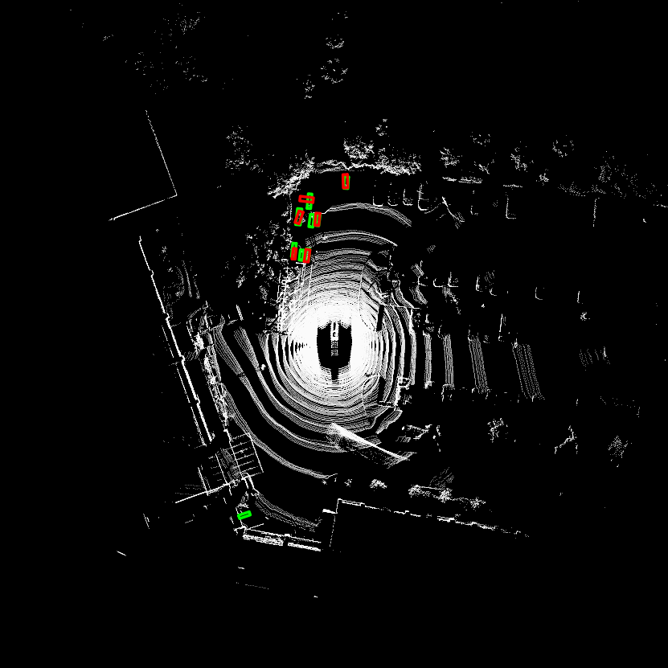
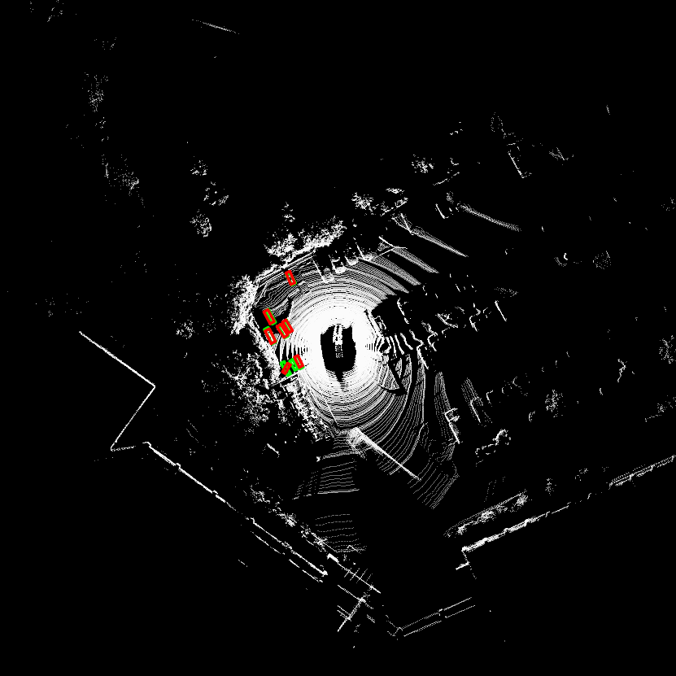
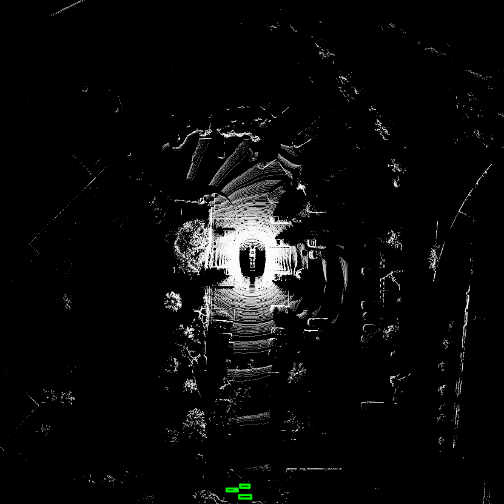
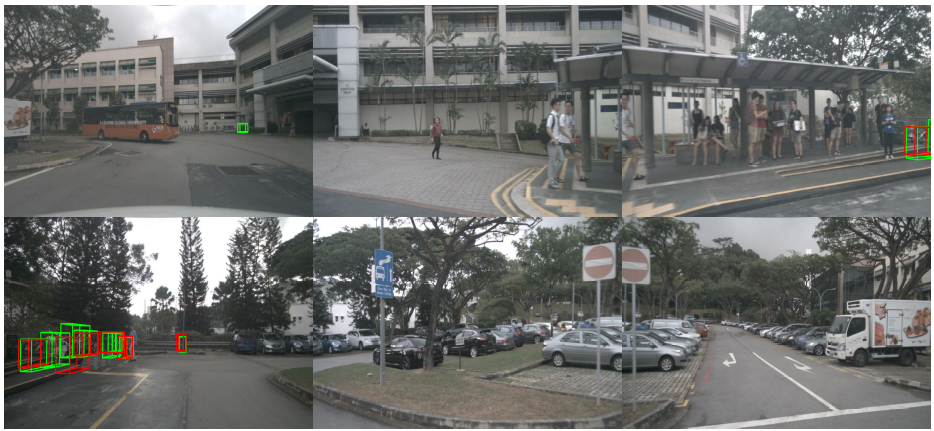
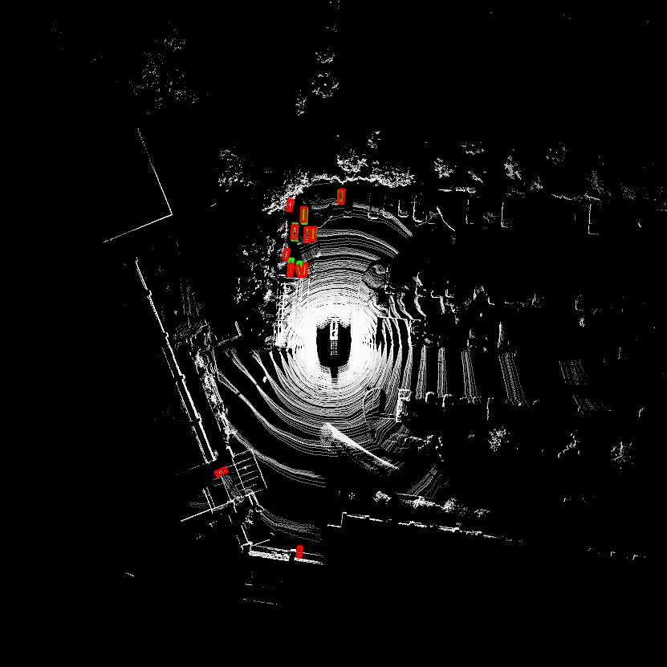
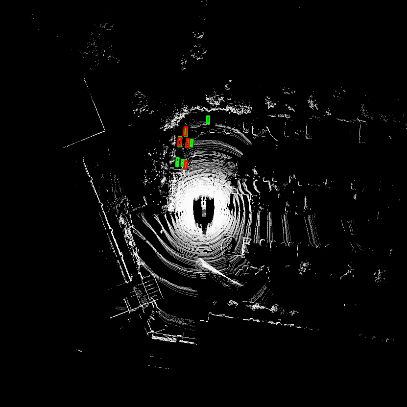

# LiDAR-Camera Fusion 3D Object Detection : Cyclist

## Overview

LiDAR와 Camera 정보를 함께 활용하는 **BEVFusion 기반 3D Object Detection 모델**을 이용하여 **Cyclist 객체를 탐지하고 시각화**하였다.

* nuScenes 데이터 구조 분석
* LiDAR-Camera 데이터 로딩
* Pretrained BEVFusion 모델 추론
* Cyclist 관련 객체(Bicycle, Motorcycle) 필터링
* Camera / LiDAR 상의 3D Bounding Box 시각화
* 결과 분석 및 개선 방향 제안

   
# Architecture Diagram
<p align="center">
    
</p>

# Project Structure

```text
.
├── checkpoints/
│   └── bevfusion-det.pth
│
├── configs/
│   └── nuscenes/
│
├── data/
│   └── nuscenes/
│
├── tools/
│   ├── create_data.py
│   ├── data_analysis_nuscenes.ipynb
│   └── visualize.py
│
└── README.md
```

# Environment


## System
| Item     | Version                             |
| -------- | ----------------------------------- |
| OS       | Ubuntu 20.04.6 LTS (Docker)                     |
| GPU      | NVIDIA GeForce RTX 3080 Ti (12GB)   |
| CUDA | 11.3 |
| Python | 3.8.20 |

## Dependencies
| Package | Version |
|---------|---------|
| PyTorch | 1.10.1 |
| MMCV | 1.4.0 |
| MMDetection | 2.20.0 |
| MMDetection3D | Installed |
| TorchPack | 0.3.1 |
| NumPy | 1.23.5 |
| OpenCV | 4.13.0 |


# Setup
#### 1. Dataset Preparation  

과제에서는 **KITTI 데이터셋 기반 Cyclist Detection**을 요구하였으나, **BEVFusion의 공식 Pretrained 모델이 nuScenes 데이터셋 기반으로 제공**되며, 제한된 저장공간과 개발 기간을 고려하여 🔗[**nuScenes-mini Dataset**](https://www.nuscenes.org/download)을 사용하였다.

다운로드 후 다음과 같은 구조로 배치한다.

```text
data/
└── nuscenes/
    ├── maps
    ├── samples
    ├── sweeps
    ├── v1.0-mini
    └── ...
```
#### 2. Dataset Preprocessing

BEVFusion에서 nuScenes 데이터를 사용하기 위해서는 raw dataset을 그대로 사용하는 것이 아니라, annotation 및 sensor metadata를 포함한 info file을 생성해야 한다.

이를 위해 MMDetection3D에서 제공하는 `create_data.py`를 사용하여 nuScenes dataset에 대한 preprocessing을 수행하였다.

과제 범위가 LiDAR-Camera Fusion 기반 3D Object Detection만 수행하므로, 사용하지 않는 Radar sensor 정보를 제외하도록 일부 코드도 수정하였다.

```bash
python tools/create_data.py nuscenes --root-path ./data/nuscenes --out-dir ./data/nuscenes --extra-tag nuscenes --version v1.0-mini
```
해당 과정을 통해 model inference 및 dataloader 구성에 필요한 nuScenes info file이 생성된다.
```bash

data/
└── nuscenes/
    ├── nuscenes_infos_train.pkl
    ├── nuscenes_infos_val.pkl
    └── ...
```

#### 3. Pretrained model

LiDAR-Camera Fusion 3D Object Detection 모델은 nuScenes Dataset으로 학습된 🔗[BEVFusion Pretrained 모델](https://www.dropbox.com/scl/fi/ulaz9z4wdwtypjhx7xdi3/bevfusion-det.pth?rlkey=ovusfi2rchjub5oafogou255v&dl=1)을 활용하였다.
직접 모델을 재학습하기보다 Pretrained Weight를 활용하여 LiDAR-Camera Fusion Detection Pipeline 구현에 집중하였다.


Checkpoint는 다음 위치에 저장한다.
```text
checkpoints/
└── bevfusion-det.pth
```

Config 파일은 다음 위치를 사용한다.
```text
configs/
└── nuscenes/
    └── det/
        └── transfusion/
            └── secfpn/
                └── camera+lidar/
                    └── swint_v0p075/
                        └── convfuser.yaml
```

# nuScenes dataset Analysis

nuScenes dataset은 자율주행 차량에서 수집한 대표적인 Multi-Sensor Autonomous Driving Dataset이다.
다양한 센서 데이터를 시간 동기화하여 제공하여 Calibration 정보를 포함하고 있어 LiDAR와 Camera 데이터를 동일한 좌표계에서 활용이 가능하다.

#### [Sensor Configuration]
<p align="center">

</p>

* 1 × 32-beam LiDAR
* 6 × RGB Cameras

  * Front
  * Front Left
  * Front Right
  * Back
  * Back Left
  * Back Right
* 5 × Radar(과제에서는 사용 x)
* GPS / IMU


#### [Data Analysis]
데이터 분석은 🔗[data_analysis_nuscenes.ipynb](tools/data_analysis_nuscenes.ipynb)에서 수행하였다.

```text
tools/data_analysis_nuscenes.ipynb
```

분석 항목

* nuScenes Dataset 구조
* Scene / Sample / Sample Data 관계
* Annotation 구조
* LiDAR 및 Camera 데이터 확인
* Bicycle / Motorcycle 객체 분포 분석
* Camera / Lidar 시각화

# LiDAR-Camera Fusion Model

#### [Model Selection]

본 프로젝트에서는 **BEVFusion**을 사용하였다.


모델 선정 이유는 다음과 같다.
- nuScenes 기반 Pretrained Weight 제공
- BEV(Bird's Eye View) 공간에서 Feature Alignment를 수행하여 효과적인 Sensor Fusion 가능
- nuScenes Benchmark에서 우수한 3D Object Detection 성능 검증

#### [Model Overview]

<p align="center">
    
</p>

BEVFusion은 Camera와 LiDAR 데이터를 각각 Feature Extraction한 후, Bird's Eye View(BEV) 공간에서 두 센서의 Feature를 융합하여 3D Bounding Box를 예측하는 Sensor Fusion 모델이다.

기존의 Early Fusion이나 Late Fusion 방식과 달리, 두 센서의 Feature를 동일한 BEV 공간으로 변환하여 융합함으로써 공간적인 정합성을 유지하면서 객체를 검출할 수 있다.

**Input**

```text
- Camera Images
- LiDAR Point Cloud
- Calibration Information
```

**Output**

```text
- 3D Bounding Boxes
- Class Label
- Confidence Score
```

GPU 메모리 제약으로 인해 Camera 입력 해상도를 [128, 352]로 축소하여 추론을 수행하였다. Prediction 결과 중 Bicycle 및 Motorcycle 클래스만 선택하여 Cyclist 객체를 분석하였다.


# 3D Bounding Box Visualization

MMDetection3D / BEVFusion에서 제공하는 기존 inference 및 visualization utility를 기반으로 3D Bounding Box 시각화 기능을 구현하였다.

기본 제공되는 Camera / LiDAR visualization 기능을 활용하되, 과제 목적에 맞게 GT / Prediction 동시 시각화, Cyclist class filtering, confidence score filtering 기능을 추가하여 결과를 보다 직관적으로 분석할 수 있도록 수정하였다.

구현 파일
```text
tools/visualize.py
```
### Camera & LiDAR Visualization

Prediction 결과를 다음 두 가지 형태로 확인할 수 있다.

- Camera Image Projection
- LiDAR Bird's Eye View(BEV)

Camera에서는 객체가 이미지 상에서 어떻게 검출되는지 확인할 수 있으며, LiDAR BEV에서는 객체의 위치와 방향을 직관적으로 확인할 수 있다.

시각화 과정
```text
Camera + LiDAR
        ↓
BEVFusion Inference
        ↓
3D Bounding Boxes
        ↓
Confidence Filtering
        ↓
Class Filtering
        ↓
Camera Projection
        ↓
LiDAR BEV Visualization
```

제공하는 기능은 다음과 같다.

* Ground Truth Bounding Box 시각화
* Prediction Bounding Box 시각화
* Camera View Projection
* LiDAR Bird's Eye View Visualization
* Confidence Score Filtering
* Class Filtering


## Features

### GT / Prediction Visualization


Ground Truth와 Prediction 결과를 선택적으로 확인할 수 있도록 다음 모드를 지원한다.

```text
--mode <mode>
```
- ```--mode gt```   : Ground Truth Bounding Box 시각화
- ```--mode pred``` : Prediction Bounding Box 시각화
- ```--mode both``` : Ground Truth와 Prediction Bounding Box 동시 시각화

```text
--bbox-classes <class_id_1> <class_id_2>
```

`--bbox-classes` 옵션을 이용하여 원하는 클래스만 선택적으로 출력할 수 있다.

```text
--bbox-score <confidence_score>
```
`--bbox-score` 통해 낮은 Confidence Score를 갖는 Bounding Box를 제거할 수 있다.


# Execution

#### GT Visualization

```bash
torchpack dist-run -np 1 python tools/visualize.py <CONFIG_PATH> --mode gt --out-dir <OUTPUT_DIR>
```

#### Prediction Visualization
```bash
torchpack dist-run -np 1 python tools/visualize.py <CONFIG_PATH> --mode pred --checkpoint <CHECKPOINT_PATH> --out-dir <OUTPUT_DIR>
```

#### GT / Prediction Visualization
```bash
torchpack dist-run -np 1 python tools/visualize.py <CONFIG_PATH> --mode both --checkpoint <CHECKPOINT_PATH> --out-dir <OUTPUT_DIR>
```

#### Cyclist Visualization Example

```bash
torchpack dist-run -np 1 python tools/visualize.py configs/nuscenes/det/transfusion/secfpn/camera+lidar/swint_v0p075/convfuser.yaml --mode both --checkpoint checkpoints/bevfusion-det.pth --out-dir viz-cyclist --bbox-score 0.4 --bbox-classes 6 7
```

# Results

### GT / Prediction Visualization

Ground Truth와 Prediction Bounding Box를 각각 시각화하여 Detection 결과를 정성적으로 비교하였다.

<p align="center">
    
</p>

| Color | Meaning |
|:---:|:---|
| 🟢 Green box | Ground Truth Bounding Box |
| 🔴 Red box | Predicted Bounding Box |

Ground Truth와 Prediction 결과를 비교함으로써 Bounding Box의 위치 및 객체 검출 결과를 직관적으로 확인할 수 있었다.

### Failure Case 1: Yaw Misalignment

<p align="center">
    
</p>
Cyclist 객체의 위치는 비교적 유사하게 검출되었으나, Prediction Bounding Box의 yaw 방향이 Ground Truth와 다르게 추정되는 사례이다. 객체가 부분적으로 가려지거나 point cloud가 sparse한 경우, Bounding Box의 orientation이 불안정해질 수 있다.

### Failure Case 2: Long-range Object Miss Detection

<p align="center">
    
</p>
Ground Truth Cyclist 객체가 존재하지만, 모델 Prediction 결과에서는 해당 객체가 검출되지 않은 미검출 사례이다. 원거리 객체의 경우 LiDAR point density가 낮아지고 Camera image에서도 객체 크기가 작게 나타나기 때문에, 모델이 Cyclist 객체의 특징을 충분히 추출하지 못할 가능성이 있다.

## Camera & LiDAR Visualization

Prediction 결과를 Camera Projection과 LiDAR BEV에서 동시에 확인하였다.

| Camera View | LiDAR BEV |
|:---:|:---:|
|  |  |

Camera에서는 객체의 Appearance를, LiDAR에서는 객체의 공간적 위치와 방향을 확인할 수 있었다.
Cyclist 객체를 확인하기 위해 Bicycle 및 Motorcycle 클래스만 선택하여 시각화를 수행하였다.


## Confidence Filtering

Confidence Threshold를 적용하여 낮은 신뢰도의 Detection을 제거하였다.

| Before | After (`bbox-score=0.4`) | After (`bbox-score=0.2`) |
|:---:|:---:|:---:|
|  |  |  |

다양한 threshold 비교를 통해 최종적으로 bbox score threshold를 0.2로 설정하였다.

# Limitations

#### Limited Dataset

본 프로젝트는 nuScenes-mini Dataset을 사용하여 구현하였다.
nuScenes-mini는 데이터 수가 제한적이므로 다양한 주행 환경과 Cyclist 객체를 충분히 포함하지 않기에 Detection 결과를 일반화하기에는 한계가 있다.

#### Input Resolution

GPU 메모리 제약으로 인해 Camera 입력 해상도를 [128, 352]로 축소하여 추론을 수행하였다.
입력 해상도 감소로 인해 이미지 feature가 충분히 활용되지 못했을 가능성이 있으며, 이는 성능 하락의 요인으로 작용했을 것으로 본다. 특히 Car에 비해 작은 객체 사이즈를 가지는 Cyclist 성능에 큰 영향을 주었을 것으로 예상한다.

#### Limited Training Pipeline Modification

제한된 개발 기간과 GPU 자원으로 인해 BEVFusion의 inference pipeline을 중심으로 구현하였다.
따라서 Cyclist 성능 향상을 위한 loss function 수정, class-balanced sampling, augmentation policy 변경, 학습 파라미터 조정 등의 학습 pipeline 개선은 수행하지 못하였다.

# Future Improvements

#### [1] Full Dataset 기반 Cyclist Fine-tuning

현재는 nuScenes-mini Dataset을 사용하여 Pipeline을 검증하였기 때문에, 다양한 주행 환경과 Cyclist 객체를 충분히 포함하지 못한다.
Full nuScenes 또는 KITTI Dataset을 활용하여 Bicycle / Motorcycle 객체를 중심으로 Fine-tuning을 수행하면 Cyclist Detection 성능을 향상시킬 수 있을 것으로 기대된다.
또한 Cyclist는 차량에 비해 크기가 작고 데이터 수가 적기 때문에, Class-balanced Sampling, Focal Loss 등을 적용하여 Class Imbalance 문제를 완화할 수 있을 것이다.


#### [2] Quantitative Evaluation 및 Failure Case Analysis

현재는 Camera Projection 및 LiDAR BEV 시각화를 통해 정성적으로 결과를 분석하였기에 정량적 결과가 부족하다.
mAP, Precision, Recall, Orientation Error 등의 Detection Metric을 이용하여 정량 평가를 수행하면 Cyclist Detection 성능을 객관적으로 분석할 수 있다.
또한, 거리에 따른 객체 분포, Occlusion, 주간/야간 환경 및 라이다 노이즈 등의 실패 사례를 분석하면 False Positive / False Negative의 원인을 파악하고 개선 방향을 수립할 수 있을 것으로 기대된다.


#### [3] Temporal Tracking 기반 검출 안정화

현재는 각 sample의 Detection 결과를 독립적으로 시각화하였다.
Object Tracking 또는 Temporal Smoothing을 적용하면 순간적인 미검출을 줄이고, Cyclist 객체의 위치와 방향을 보다 안정적으로 추정할 수 있을 것으로 기대된다.
또한 연속 프레임의 정보를 활용하여 Bounding Box의 급격한 흔들림을 완화하고, 특히 주행 방향을 나타내는 yaw 값의 안정화에도 도움이 될 것으로 기대된다.

# Conclusion

**nuScenes-mini Dataset**과 **BEVFusion Pretrained 모델**을 활용하여 LiDAR-Camera Fusion 기반 3D Object Detection Pipeline을 구현하였다.

nuScenes Dataset의 구조와 Annotation을 분석하였으며, BEVFusion 모델을 이용하여 3D Object Detection을 수행하였다. 이 과정에서 Cyclist와 관련된 Bicycle 및 Motorcycle 객체를 중심으로 추론 결과를 분석하였다.

또한 Camera Projection과 LiDAR Bird's Eye View(BEV) Visualization을 구현하여 Ground Truth와 Prediction Bounding Box를 직관적으로 비교할 수 있도록 하였으며, Confidence Threshold와 Class Filtering을 적용하여 Cyclist 객체를 효과적으로 시각화하였다.

향후에는 Full Dataset 기반 Fine-tuning과 정량적인 성능 평가를 추가하여 Cyclist Detection 성능을 더욱 향상시킬 수 있을 것으로 기대된다.
